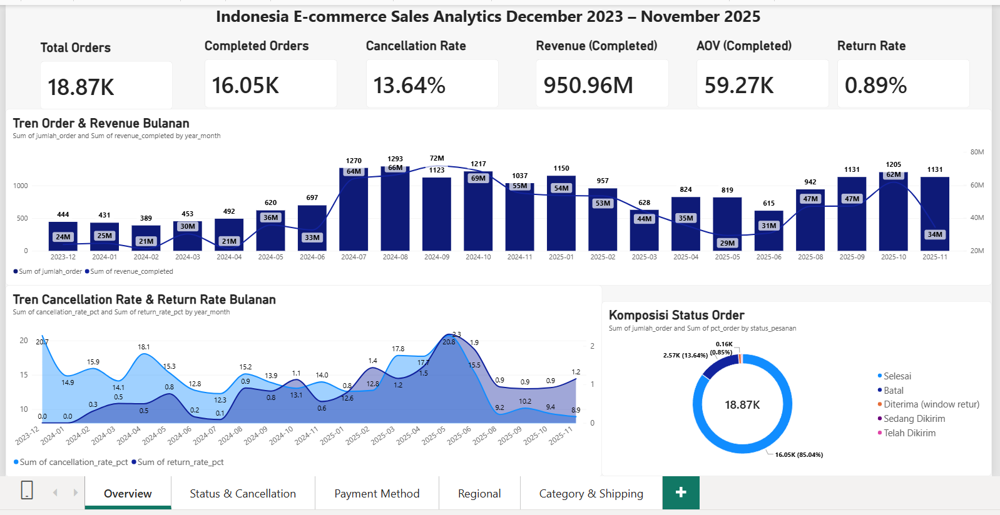
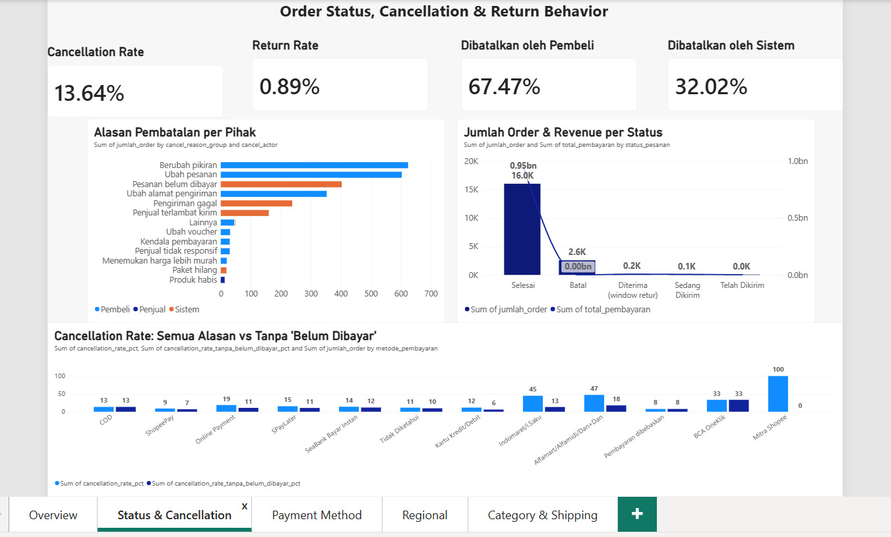
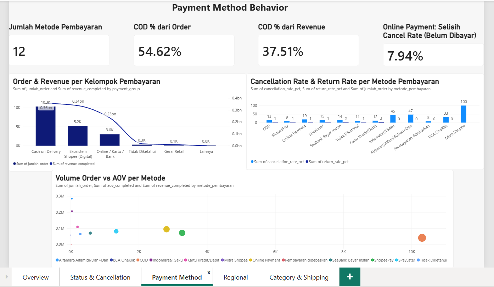
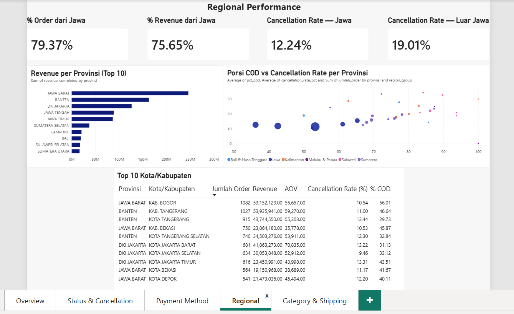
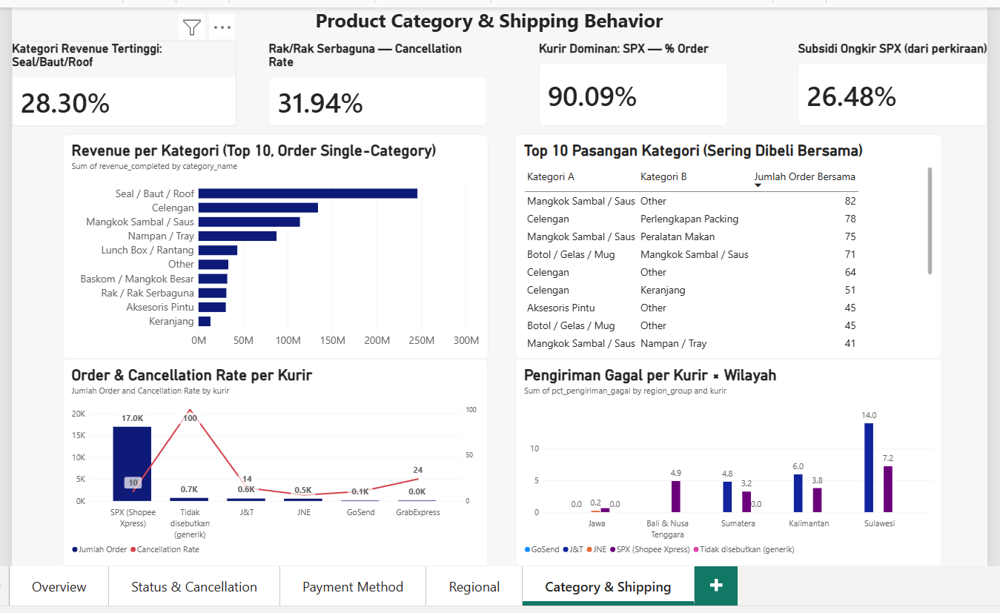

# Indonesia E-commerce Sales Analytics

> ✅ **Status: Selesai** — pipeline data (Tahap 0–15) dan dashboard Power BI
> 5 halaman sudah lengkap dan terverifikasi.

Portfolio project **data analyst** berbasis dataset transaksional e-commerce
Indonesia (`indonesia_ecommerce_sales_challenging.csv`, 18.868 baris, 19
kolom, grain **1 baris = 1 order**). Dibangun end-to-end: data cleaning &
modeling pakai **SQL/DuckDB**, business analysis, sampai dashboard interaktif
di **Power BI**.

---

## Daftar Isi

- [Business Understanding](#business-understanding)
- [Tech Stack & Workflow](#tech-stack--workflow)
- [Struktur Folder](#struktur-folder)
- [Data Model](#data-model)
- [Insight Utama](#insight-utama)
- [Dashboard](#dashboard)
- [Cara Reproduce](#cara-reproduce)
- [Dokumentasi Lengkap per Tahap](#dokumentasi-lengkap-per-tahap)
- [Batasan Data](#batasan-data)

---

## Business Understanding

**Scope (IN):** Sales & Revenue Performance, Order Status/Cancellation/Return
Behavior, Payment Method Behavior, Regional Performance, Product Category
Performance (agregat + co-occurrence), Shipping Behavior.

**Scope (OUT):** Customer Segmentation/RFM, Repeat-Purchase Rate, CLV, Market
Basket Analysis — dataset tidak punya `customer_id` dan tidak punya
item-level basket. Seluruh analisis bersifat **descriptive** dan
**diagnostic**, bukan predictive/causal.

**8 Business Questions** yang dijawab project ini, lengkap dengan Data
Feasibility Check dan Success Criteria, ada di
[`docs/business_understanding.md`](docs/business_understanding.md).

## Tech Stack & Workflow

| Tahap | Tools |
|---|---|
| Data cleaning, modeling, analysis | SQL (DuckDB) |
| Data mart & export | DuckDB → Parquet |
| Dashboard | Power BI Desktop |
| Version control | Git & GitHub |

**Workflow:** `SETUP → PROFILE → CLEAN → VALIDATE → EDA → MODEL → ANALYZE → MART → DASHBOARD → COMMUNICATE → QA/PUBLISH`

Seluruh proyek mengikuti "Aturan Main" yang disepakati di awal: commit per
tahap SQL selesai dijalankan, setiap file `.sql` punya `.md` pendamping
berisi Input/Proses Analisis/Temuan/Output/Assumptions/Kesimpulan.

## Struktur Folder

```
data/
  raw/          # CSV asli, read-only, source of truth
  data_mart/    # 11 file parquet (Tahap 14-15), sumber langsung dashboard
sql/            # 02_*.sql s.d. 14_*.sql — satu file per tahap, lengkap & siap .read
docs/           # business understanding, findings tiap tahap, insights
dashboard/      # indo_ecommerce_sales_analytics.pbix
screenshots/    # screenshot 5 halaman dashboard
```

## Data Model

Star schema dibentuk di Tahap 8 (`sql/07_data_modeling.sql`), grain fact = 1
order:

```
fact_orders ──┬── dim_date
              ├── dim_status
              ├── dim_cancellation_reason
              ├── dim_payment_method
              ├── dim_location
              ├── dim_shipping
              └── bridge_order_category ── dim_category
```

Kategori produk disimpan lewat bridge table (many-to-many) karena satu order
bisa punya lebih dari satu kategori — detail penanganan dobel-hitung revenue
ada di [`docs/11_product_category.md`](docs/11_product_category.md).

## Insight Utama

6 insight utama (bukti angka + rekomendasi) ada di
[`docs/insights.md`](docs/insights.md). Tiga yang paling penting:

1. **Cancellation rate Online Payment yang terlihat tinggi (18,68%) ternyata
   didorong auto-cancel "belum dibayar"** — setelah dikeluarkan, turun ke
   10,74%, lebih rendah dari COD (13,43%).
2. **Pengiriman gagal di luar Jawa adalah masalah kurir yang sama (SPX, J&T)
   yang gagal lebih sering**, bukan pergantian kurir — tingkat kegagalan SPX
   naik dari 0,63% (Jawa) ke 7,23% (Sulawesi), sekitar 11,5 kali lipat.
3. **COD mendominasi 54,6% order tapi cuma 37,5% revenue** — AOV-nya (Rp
   40.768) jauh di bawah metode pembayaran digital/kartu (Rp 73.889–95.217).

## Dashboard

File: [`dashboard/indo_ecommerce_sales_analytics.pbix`](dashboard/indo_ecommerce_sales_analytics.pbix)
— 5 halaman:

### 1. Overview
KPI ringkasan (total order, revenue, AOV, cancellation & return rate), tren
bulanan order/revenue, tren cancellation & return rate, komposisi status
order.



### 2. Status & Cancellation
Alasan pembatalan per pihak (Pembeli/Sistem/Penjual), jumlah order & revenue
per status, dan perbandingan cancellation rate dengan/tanpa alasan "belum
dibayar" per metode pembayaran.



### 3. Payment Method
Order & revenue per kelompok pembayaran, cancellation & return rate per
metode, scatter volume order vs AOV.



### 4. Regional
Revenue per provinsi (top 10), scatter porsi COD vs cancellation rate per
provinsi (34 titik), tabel top 10 kota/kabupaten.



### 5. Category & Shipping
Revenue per kategori produk, top 10 pasangan kategori yang sering dibeli
bersama, performa per kurir, pengiriman gagal per kurir × wilayah.



> **Catatan:** 11 mart yang jadi sumber dashboard ini sengaja denormalized
> dan berdiri sendiri-sendiri (bukan saling berelasi) — setiap mart sudah
> pre-agregat di grain-nya masing-masing.

## Cara Reproduce

Prasyarat: [DuckDB CLI](https://duckdb.org/docs/installation/), Power BI
Desktop.

```powershell
git clone https://github.com/ahmadfariden/indo-ecommerce-sales-analytics.git
cd indo-ecommerce-sales-analytics

# Taruh CSV mentah di data/raw/, lalu jalankan seluruh pipeline berurutan:
.\duckdb.exe indo.duckdb -c ".read sql/02_data_collection.sql"
.\duckdb.exe indo.duckdb -c ".read sql/03_data_profiling.sql"
.\duckdb.exe indo.duckdb -c ".read sql/04_data_cleaning.sql"
.\duckdb.exe indo.duckdb -c ".read sql/05_data_validation.sql"
.\duckdb.exe indo.duckdb -c ".read sql/06_eda.sql"
.\duckdb.exe indo.duckdb -c ".read sql/07_data_modeling.sql"
.\duckdb.exe indo.duckdb -c ".read sql/08_order_status_cancellation_return.sql"
.\duckdb.exe indo.duckdb -c ".read sql/09_payment_method.sql"
.\duckdb.exe indo.duckdb -c ".read sql/10_regional_performance.sql"
.\duckdb.exe indo.duckdb -c ".read sql/11_product_category.sql"
.\duckdb.exe indo.duckdb -c ".read sql/12_shipping_behavior.sql"
.\duckdb.exe indo.duckdb -c ".read sql/13_marts.sql"
.\duckdb.exe indo.duckdb -c ".read sql/14_parquet_export.sql"

# Buka dashboard/indo_ecommerce_sales_analytics.pbix di Power BI Desktop
# Refresh kalau data/data_mart/*.parquet berubah
```

> `sql/10_regional_performance.sql` dan `sql/12_shipping_behavior.sql`
> masing-masing membuat view (`v_orders_region`, `v_shipping_parsed`) yang
> dipakai lagi oleh `sql/13_marts.sql` — jalankan berurutan, jangan di-skip.

## Dokumentasi Lengkap per Tahap

Setiap file `sql/*.sql` punya `.md` pendamping di `docs/` (Input, Proses
Analisis, Temuan, Output, Assumptions, Kesimpulan):

| Tahap | SQL | Dokumentasi |
|---|---|---|
| 2 — Business Understanding | — | [`docs/business_understanding.md`](docs/business_understanding.md) |
| 3 — Data Collection | `sql/02_data_collection.sql` | [`docs/02_data_collection.md`](docs/02_data_collection.md) |
| 4 — Data Profiling | `sql/03_data_profiling.sql` | [`docs/03_data_profiling.md`](docs/03_data_profiling.md) |
| 5 — Data Cleaning | `sql/04_data_cleaning.sql` | [`docs/04_data_cleaning.md`](docs/04_data_cleaning.md) |
| 6 — Data Validation | `sql/05_data_validation.sql` | [`docs/05_data_validation.md`](docs/05_data_validation.md) |
| 7 — EDA | `sql/06_eda.sql` | [`docs/06_eda.md`](docs/06_eda.md) |
| 8 — Data Modeling | `sql/07_data_modeling.sql` | [`docs/07_data_modeling.md`](docs/07_data_modeling.md) |
| 9 — Order Status, Cancellation & Return | `sql/08_order_status_cancellation_return.sql` | [`docs/08_order_status_cancellation_return.md`](docs/08_order_status_cancellation_return.md) |
| 10 — Payment Method | `sql/09_payment_method.sql` | [`docs/09_payment_method.md`](docs/09_payment_method.md) |
| 11 — Regional Performance | `sql/10_regional_performance.sql` | [`docs/10_regional_performance.md`](docs/10_regional_performance.md) |
| 12 — Product Category | `sql/11_product_category.sql` | [`docs/11_product_category.md`](docs/11_product_category.md) |
| 13 — Shipping Behavior | `sql/12_shipping_behavior.sql` | [`docs/12_shipping_behavior.md`](docs/12_shipping_behavior.md) |
| 14 — Data Mart | `sql/13_marts.sql` | [`docs/13_marts.md`](docs/13_marts.md) |
| 15 — Parquet Export | `sql/14_parquet_export.sql` | [`docs/14_parquet_export.md`](docs/14_parquet_export.md) |

## Batasan Data

- Tidak ada `customer_id` → tidak bisa analisis pembeli berulang/CLV, dan
  tidak bisa mengecek apakah pembatalan diikuti pemesanan ulang.
- Tidak ada item-level basket → category co-occurrence dihitung di level
  kategori agregat, bukan SKU.
- Tidak ada nilai/alasan retur → hanya `total_returned_qty` yang tersedia.
- Order Batal punya `total_pembayaran` = 0 → revenue yang hilang akibat
  pembatalan tidak bisa dihitung dari dataset ini.
- November 2025 (bulan terakhir) belum matang saat data diambil — 250 order
  masih berstatus In-Progress, ditandai di `mart_monthly_trend` lewat flag
  `is_incomplete_month`.

Detail batasan lengkap per topik ada di bagian "Batasan Data" masing-masing
file `.md` di `docs/`.
