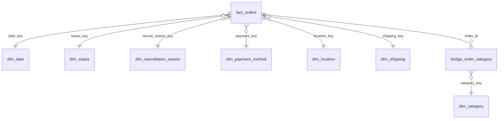

# 07 — Data Modeling

## Input
- Table `sales` (hasil Tahap 5, divalidasi di Tahap 6)
- Pola dari EDA (`docs/06_eda.md`) sebagai dasar pemilihan dimensi
- Dijalankan via `sql/07_data_modeling.sql`

## Proses Analisis
1. Tentukan grain fact: **1 baris = 1 order** (`order_id` unik, sudah terbukti di Tahap 6).
2. Pisahkan atribut deskriptif ke dimensi: tanggal, status, alasan pembatalan, metode pembayaran, lokasi, opsi pengiriman, kategori produk.
3. Karena `product_categories` berisi daftar kategori dipisah koma (1 order bisa punya >1 kategori), relasi order–kategori dimodelkan lewat **bridge table**, bukan dimasukkan ke fact.
4. Tambahkan kolom pengelompokan analitik di dimensi (`status_group`, `cancel_actor`, `cancel_reason_group`, `payment_group`) tanpa membuang nilai mentahnya.
5. Bentuk `fact_orders` dengan `LEFT JOIN` ke semua dimensi supaya key yang gagal match kelihatan sebagai `NULL` di validasi.
6. Jalankan 10 query validasi model (row count, grain, reconciliation revenue, orphan key, coverage `dim_date`, mapping grouping, bridge, uji star join).

## Model

| Table | Baris | Keterangan |
|---|---:|---|
| `fact_orders` | 18.868 | grain 1 order, measures + 2 flag dari Tahap 5 |
| `dim_date` | 731 | 2023-12-01 s.d. 2025-11-30, ada `is_missing_period_month` |
| `dim_status` | 5 | `status_group`: Completed / Cancelled / In-Progress |
| `dim_cancellation_reason` | 19 | alasan mentah + `cancel_actor` + `cancel_reason_detail` + `cancel_reason_group` |
| `dim_payment_method` | 12 | + `payment_group` |
| `dim_location` | 418 | kombinasi unik `provinsi` + `kota_kabupaten` |
| `dim_shipping` | 45 | opsi pengiriman mentah, belum diparsing |
| `dim_category` | 38 | nama kategori produk unik |
| `bridge_order_category` | 21.009 | relasi many-to-many order–kategori |

## Temuan
- **Model lolos seluruh validasi:** `fact_orders` 18.868 baris dengan `order_id` unik; revenue fact identik dengan `sales` (Rp 962.091.801); tidak ada orphan key di 6 foreign key; semua `date_key` fact ada di `dim_date`.
- **`dim_date` menandai missing period secara data-driven:** hanya 2024-12 dan 2025-07 yang `is_missing_period_month = TRUE`, cocok dengan Tahap 4.
- **Tidak ada nilai `Belum Terpetakan`** di `cancel_actor`, `cancel_reason_group`, maupun `payment_group` — seluruh 19 alasan pembatalan dan 12 metode pembayaran terpetakan.
- **Bridge kategori konsisten:** 18.868 order semuanya punya kategori; 21.009 baris bridge = `SUM(num_product_categories)`, artinya tidak ada kategori ganda dalam satu order. Rata-rata sekitar 1,11 kategori per order.
- **Alasan pembatalan mentah punya varian dengan makna sama** (mis. "Need to change delivery address" dan "Perlu mengubah alamat pengiriman"; "Ubah Pesanan yang Ada" dan "Perlu mengubah pesanan"). Ini tidak tertangani di Tahap 5 dan diselesaikan di lapisan model lewat `cancel_reason_group` (19 alasan mentah → 14 grup, termasuk "Tidak Dibatalkan").
- **Komposisi pembatalan berdasarkan pihak (dari 2.573 order Batal):** Pembeli 1.736 (67,5%), Sistem 824 (32,0%), Penjual 13 (0,5%).
- Uji star join menghasilkan Revenue Completed Orders Rp 950.963.704, sama persis dengan angka EDA di Tahap 7.

## Output
- Table DuckDB: `fact_orders`, `dim_date`, `dim_status`, `dim_cancellation_reason`, `dim_payment_method`, `dim_location`, `dim_shipping`, `dim_category`, `bridge_order_category` (di `indo.duckdb`).
- Model ini jadi basis query Business Analysis di Tahap 9–13 dan data mart di Tahap 14.

## Assumptions
- Grain fact adalah 1 order; analisis kategori produk dilakukan lewat bridge, sehingga menjumlahkan revenue per kategori akan menghitung ganda order multi-kategori (7,24% order). Untuk analisis revenue per kategori, perlu aturan alokasi atau cukup dipakai untuk hitungan order/frekuensi.
- `payment_group` adalah pengelompokan analitik: COD → "Cash on Delivery"; ShopeePay, SPayLater, SeaBank Bayar Instan → "Ekosistem Shopee (Digital)"; Online Payment, Kartu Kredit/Debit, BCA OneKlik → "Online / Kartu / Bank"; hanya Indomaret/i.Saku dan Alfamart/Alfamidi/Dan+Dan → "Gerai Retail"; Pembayaran dibebaskan dan Mitra Shopee → "Lainnya". Nilai mentah `metode_pembayaran` tetap ada di dimensi, jadi pengelompokan bisa diubah tanpa membangun ulang data.
- `cancel_reason_group` menyamakan alasan berbahasa Inggris dan Indonesia yang bermakna sama, dan menggabungkan "Lainnya/ berubah pikiran" dengan "Tidak ingin membeli lagi" ke "Berubah pikiran". "Lainnya" (oleh Pembeli dan oleh Sistem) dibiarkan sebagai grup sendiri dan dibedakan lewat `cancel_actor`.
- `dim_shipping` menyimpan `opsi_pengiriman` apa adanya; parsing tier layanan vs kurir tetap ditunda ke Tahap 13 (sesuai keputusan Tahap 5).
- `dim_location` (418 kombinasi provinsi–kota) dan `dim_category` (38 kategori) **belum diperiksa untuk varian penulisan** (mis. beda kapitalisasi atau ejaan nama kota/kategori). Validasi di Tahap 6 hanya mengecek `provinsi`, belum `kota_kabupaten`. Ini perlu dicek di awal Tahap 11 (Regional) dan Tahap 12 (Kategori) sebelum angka dipakai.

## Kesimpulan
Star schema berhasil dibentuk dari `sales` tanpa kehilangan baris maupun selisih nilai finansial, dan seluruh validasi struktural lolos. Model siap dipakai untuk Business Analysis. Dua hal yang perlu diperhatikan ke depan: pengelompokan analitik di dimensi adalah keputusan yang bisa disesuaikan, dan kualitas nama kota serta kategori masih perlu diperiksa sebelum dipakai di Tahap 11 dan 12. Lanjut ke Tahap 9 — Order Status, Cancellation & Return Behavior.
